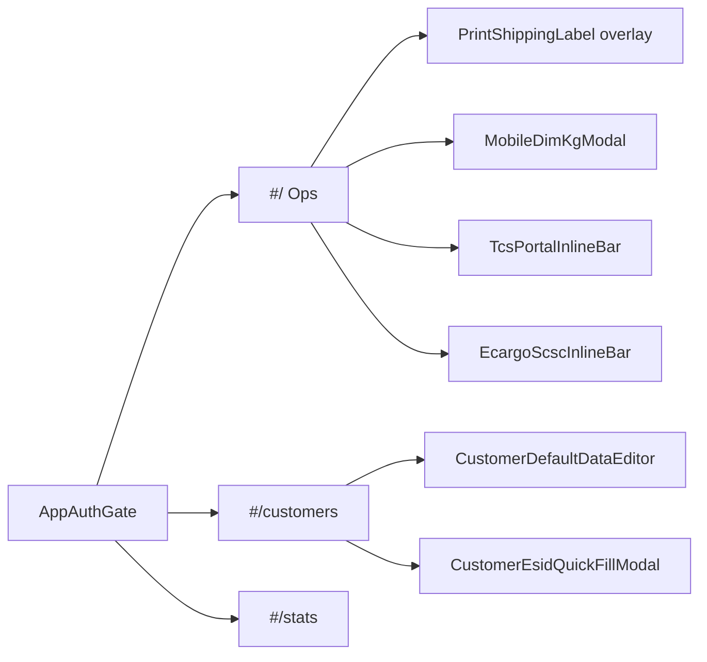

# TECSOPS — Phase 0 Redesign Audit

> Giai đoạn 0 của `docs/TECSOPS_CURSOR_REDESIGN_UPGRADE_SPEC.md`.  
> **Chỉ khảo sát.** Không sửa UI, schema, API, Ext, print layout, auth, hay nghiệp vụ.  
> Base: `main` @ `04a5f43` (`feat(ui): modal DIM — Đo nhanh mặc định, Nâng cao thu gọn` #68).  
> Ngày audit: 2026-08-23.  
> Phương án gỡ/sửa (chọn gói A/B/C): `docs/TECSOPS-REDESIGN-OPTIONS.md`.

---

## 📌 Tóm tắt tổng quan

| Hạng mục | Kết quả |
|---|---|
| Tập tin frontend `src/` | 268 `.ts`/`.tsx` |
| Server | 38 file trong `server/` |
| Test file | 92 |
| Typecheck / lint / unit test / build | 🟢 PASS |
| E2E + screenshot breakpoint | ⚪ Không chạy (thiếu Postgres/Docker trong môi trường audit) |
| Mức rủi ro hệ thống nếu redesign mù | 🔴 Cao — nghiệp vụ kho/eSID/print/Ext đang sống |
| Mức rủi ro nếu làm đúng Phase 0→PR nhỏ | 🟡 Trung bình |
| Đợt A–C spec | **Đã làm phần lớn** (Round 2–3 + PR #60–#68) |
| Việc còn lại có giá trị vận hành | Chuẩn hóa kit, gỡ token kép, ConfirmDialog, polish Customers, bảng (sort/cột), preview in |

**Kết luận kiến trúc:** TECSOPS không còn là UI cũ cần “làm đẹp từ đầu”. Đây là ứng dụng vận hành đã có design system một phần, day-board Ops đã densify, workflow theo kho đã có SoT, portal đã Ext-only. Redesign tiếp theo phải **bảo toàn nghiệp vụ** và chỉ vá chỗ kit/token/UX còn lệch spec.

Không được bắt đầu bằng rewrite `AirCargoTracking`, `CustomersPage`, `MobileDimKgModal`, print, hay Ext.

---

## 1. Tech stack và cách chạy

### Stack thực tế (không phải mô tả skill cũ)

| Lớp | Công nghệ | Ghi chú |
|---|---|---|
| Frontend | React 18.3 + Vite 5.4 + TypeScript 5.6 | Hash route, không React Router |
| CSS | Tailwind 3.4 + `src/index.css` | Light mode chính thức; token `ui-*` |
| UI kit | `src/ui/*` | Button/Toast/Banner/AppShell đã dùng; Input/Card/Badge **chưa** có consumer live |
| Icon | SVG inline | **Không** có `lucide-react` |
| Font | Plus Jakarta Sans + IBM Plex Mono (Google Fonts) | Đúng spec §4.3 |
| Backend | Express 4 + Socket.IO 4 | `server/index.mjs` |
| DB | Postgres (`pg`) — bắt buộc | Bảng `app_state` (jsonb) + bảng quan hệ khách |
| Sync overlay | namnamlogistics Supabase (chỉ SELECT `synced_at`) | Không migration |
| Excel | ExcelJS 4.4 | Chunk `vendor-excel` ~939 kB |
| PDF | pdf-lib + fontkit | Chunk `PDFButton` ~1.0 MB |
| Charts | recharts 2.15 | Chunk Stats ~442 kB; package deprecated (nhánh 2.x) |
| OCR Ext | onnxruntime-web 1.21 | Chỉ trong Chrome Ext, không dual-agent |
| eCargo OTP | imapflow + mailparser | IMAP Gmail App Password |
| Auth | Shared token `TECSOPS_APP_TOKEN` + cookie `tecsops_session` | `AppAuthGate` |
| Deploy | Railway + Docker multi-stage | `npm run start:railway` |
| Test | Vitest 2.1 + Playwright (E2E tách) | CI: `npm run ci` |

### Cách chạy

```bash
# Local
cp .env.example .env.local   # điền DATABASE_URL
npm ci
docker compose up -d         # Postgres :5434
npm run dev                  # API :3001 + Vite :5173 (proxy /api, /socket.io)

# Kiểm tra
npm run typecheck
npm run lint && npm run lint:server
npm test
npm run build
npm run deploy:check
```

Production: `NODE_ENV=production` + `DATABASE_URL` + `TECSOPS_APP_TOKEN` (≥24 ký tự). Bypass thử nghiệm: `TECSOPS_ALLOW_UNAUTHENTICATED=1`.

**Không còn:** Python Playwright agent, `/tcs-agent`, Gemini, Google Sheet import, thư mục `chrome-extension/` legacy.

---

## 2. Sơ đồ route / màn hình

Hash router `src/hooks/useHashRoute.ts` — 3 route:

```
#/            Ops day board     AirCargoTracking
#/customers   Danh bạ khách     CustomersPage (lazy)
#/stats       Thống kê          OpsStatsPage (lazy)
```

`App.tsx`:

- `AppAuthGate` → `AuthenticatedApp`.
- `useShipmentSync` scope: Ops/Customers theo `sessionDate`; Stats `full: true`.
- Mobile: `BottomNav` (Ops / Khách / Thống kê).
- Print overlay: lazy `PrintShippingLabel` (không phải route).

Không sidebar. Không React Router. Giữ hash — không có lý do kỹ thuật để đổi router.



---

## 3. Bản đồ component → file → dữ liệu / API

### 3.1 Dấu vết spec §3 — đối chiếu file thật

| Dấu vết spec | File thật | Trạng thái |
|---|---|---|
| `useHashRoute` | `src/hooks/useHashRoute.ts` | KEEP |
| `App.tsx` | `src/App.tsx` | KEEP |
| `AirCargoTracking` | `src/components/AirCargoTracking.tsx` (779 dòng) | KEEP / IMPROVE tách trách nhiệm sau |
| `OpsMobileStickyHeader` | `src/components/OpsMobileStickyHeader.tsx` | KEEP — chrome 2 hàng #63 |
| `StatInline` | — | **KHÔNG CÒN** — KPI = `KpiStat` trong `OpsDayOverviewStrip` |
| `OpsDatePicker` | `src/components/OpsDatePicker.tsx` | KEEP |
| `SmartSearchBar` | `src/components/SmartSearchBar.tsx` | KEEP |
| `WarehouseGridPicker` | `src/components/WarehouseGridPicker.tsx` | KEEP — chỉ dùng trong DayPulse strip |
| `NewBookingButton` | `src/components/NewBookingButton.tsx` | KEEP — CTA chính desktop + FAB mobile |
| `DesktopShipmentTable` | `src/components/DesktopShipmentTable.tsx` (560) | KEEP / IMPROVE |
| `MobileShipmentCards` | `src/components/MobileShipmentCards.tsx` | KEEP |
| `MobileShipmentEditSheet` | `src/components/MobileShipmentEditSheet.tsx` (644) | KEEP |
| `StickyMobileActions` | — | **ĐÃ GỠ** #63 — FAB `OpsMobileBookingFab` thay |
| `HoverMagnifyText` | — | **ĐÃ GỠ** |
| `SelectableTextWithCopyPopover` | `src/components/SelectableTextWithCopyPopover.tsx` | KEEP |
| `ShipmentRowActionsMenu` | `src/components/ShipmentRowActionsMenu.tsx` | KEEP |
| `CustomerPicker` | `CustomerPickerField.tsx` | KEEP |
| `SuggestDropdown` | `CustomerSuggestDropdown.tsx` | KEEP |
| `StatusFilterBar` | `src/components/StatusFilterBar.tsx` | KEEP |
| `StatusBadge` / `StatusSelect` | `src/components/StatusBadge.tsx` | KEEP |
| `MobileDimKgModal` | `src/components/MobileDimKgModal.tsx` (1408) | KEEP — vừa redesign #68 |
| `GoogleSheetImportModal` | — | **ĐÃ GỠ** A3 — spec §5.8 **lỗi thời** |
| `PrintShippingLabel` | `src/components/PrintShippingLabel.tsx` | KEEP — no-touch layout in |
| `AirlineLabelSettingsModal` | `src/components/AirlineLabelSettingsModal.tsx` | KEEP |
| `TcsPortalInlineBar` | `src/components/TcsPortalInlineBar.tsx` | KEEP — Ext-only #55 |
| `CustomerEsidQuickFillModal` | `.../CustomerEsidQuickFillModal.tsx` | KEEP (P3 — đánh giá sau) |
| `CustomersPage` | `src/pages/CustomersPage.tsx` (1235) | KEEP / IMPROVE |
| `CustomerSavedProfilesEditor` | cùng file, alias deprecated → `CustomerDefaultDataEditor` | **KEEP** — tab «Hồ sơ mặc định»; cấp dữ liệu in/eSID |
| `CustomerDeleteConfirmModal` | `.../CustomerDeleteConfirmModal.tsx` | KEEP |
| `opsModalStyles` | `src/styles/opsModalStyles.ts` | IMPROVE — token `apple-*` song song `ui-*` |
| `mobileOpsStyles` | `src/styles/mobileOpsStyles.ts` | KEEP |

### 3.2 Shell / kit

| Component | File | Consumer live | Quyết định |
|---|---|---|---|
| `AppShell` | `src/ui/AppShell.tsx` | Ops, Customers, Stats | IMPROVE — còn `backdrop-blur-[6px]` (lệch spec §4.1) |
| `KpiStat` | cùng file | `OpsDayOverviewStrip` | KEEP |
| `Button` / `IconButton` | `src/ui/Button.tsx` | Nhiều | KEEP |
| `Toast` / `notify` | `src/ui/Toast.tsx`, `notify.ts` | Toàn app | KEEP |
| `Banner` / `InlineError` | `src/ui/Banner.tsx` | Ops, DIM, Customers | KEEP |
| `EmptyState` / `ErrorState` | `src/ui/EmptyState.tsx` | Ops, Stats, Auth | KEEP |
| `OverflowMenu` | `src/ui/OverflowMenu.tsx` | Command bar, DIM | KEEP |
| `ConfirmDialog` | `src/ui/ConfirmDialog.tsx` | Chỉ Customers (2 chỗ) | IMPROVE — mở rộng thay `window.confirm` |
| `Input` / `TextArea` / `Select` | `src/ui/Input.tsx` | **0 consumer** | ADOPT — Customers/Stats đang tự `FIELD` |
| `Card` | `src/ui/Card.tsx` | **0 consumer** | ADOPT hoặc giữ barrel |
| `Badge` | `src/ui/Badge.tsx` | **0 consumer** | ADOPT (đừng nhân badge ad-hoc) |
| `Wordmark` | `src/ui/Wordmark.tsx` | Header | KEEP — TECS navy + OPS teal |
| `BottomNav` | `src/ui/BottomNav.tsx` | Mobile | KEEP |
| `SyncStatusPill` | `src/ui/SyncStatusPill.tsx` | Header | KEEP |
| `DataTable` (spec §4.4) | **chưa có** | Bảng Ops custom | Không tạo trừ khi tách từ `DesktopShipmentTable` |

### 3.3 API / Socket

| Endpoint | Auth | Mục đích |
|---|---|---|
| `GET /api/health` | không | Railway + Postgres ping |
| `GET /api/auth/status` `POST /api/auth/login` `POST /api/auth/logout` | — | Shared-token session |
| `GET /api/state` | requireAuth | State theo scope ngày / full |
| `GET /api/sync-meta` | requireAuth | Overlay `synced_at` namnamlogistics |
| `POST /api/mutation` `POST /api/mutations` | requireAuth + rate limit | Mutation SoT |
| `GET /api/chrome-extensions` + alias Ext | không | Catalog ZIP TCS/SCSC |
| `GET /api/lookup/airports\|customers\|…` | **không** | Lookup DB — xem Finding bảo mật |
| `/api/ecargo/otp/*` + VCT | **không thấy requireAuth** | OTP IMAP / kết quả VCT |
| Socket.IO `/socket.io/` | `socketMiddleware` | `emitScopedSync` |

Mutation (`src/utils/shipmentMutations.ts`): `UPDATE` `DELETE` `ADD` `SET_CUSTOMERS` `RESET_TRIAL_DATA` `SET_AIRLINE_LABEL_OVERRIDES` `SET_PRINTER_PROFILES` `SET_ESID_*` `SET_ECARGO_*`.

### 3.4 Database (không đổi trong redesign)

- `app_state` — blob jsonb (`POSTGRES_STATE_KEY`, mặc định `tecsops:state`).
- Quan hệ khách: `customers`, `customer_print_profiles`, `customer_consignees`, `customer_shippers`, `customer_agents`, `customer_parties`.
- `shipments` + `state_meta` (store Postgres).
- Overlay ngoài: `lots.synced_at`, `ops_customers.synced_at` (namnamlogistics, chỉ SELECT).
- Enum kho lưu: `TECS-TCS` \| `TECS-SCSC` \| `TCS` \| `SCSC`.
- Enum status lưu nguyên, kể cả lịch sử `CUSTOMS` / `SECURITY` / `COMPLETED`.

---

## 4. Feature inventory

Quyết định: KEEP = giữ nguyên hành vi; IMPROVE = UI/kit không đụng SoT; REDESIGN = màn hình lớn, vẫn giữ API; MERGE = gộp UI trùng; SIMPLIFY = bớt chrome; REMOVE = chỉ khi đã chứng minh chết.

| Feature | Route | Thành phần chính | Mục đích / workflow | I/O | Phụ thuộc | UI/UX hiện tại | Nợ kỹ thuật | Rủi ro | Quyết định |
|---|---|---|---|---|---|---|---|---|---|
| Ops day board | `#/` | `AirCargoTracking`, command bar, DayPulse | Bảng ngày: xem/sửa lô, đổi kho, booking | sessionDate, filter, mutation UPDATE/ADD | `/api/state`, Socket | 2 hàng chrome; Booking CTA; chip 4 kho | File 779 dòng điều phối nhiều modal | Cao | KEEP + IMPROVE dần |
| Bảng lô desktop | `#/` | `DesktopShipmentTable` + inline edit | Sửa Excel-like AWB/số/KH/CNEE | patch từng field | mutation UPDATE | Sticky AWB, zebra, hover `ops-inline-edit` | Không sort/ẩn cột/virtualize; không bulk | Cao | IMPROVE |
| Card lô mobile | `#/` | `MobileShipmentCards` + EditSheet | Monitor + sửa nhanh | tap → sheet | cùng sync | 2 dòng AWB+meta; FAB Booking | `contentVisibility`; sheet dài | Trung | KEEP |
| Booking | `#/` | `NewBookingButton`, `blankShipment` | Tạo lô trống theo kho đang xem | ADD | workflow auto PENDING | Desktop nút; mobile FAB | — | Cao | KEEP |
| Tìm AWB | `#/` | `SmartSearchBar` | Tìm AWB/lô, đổi kho, highlight | query local | `shipmentSearch` | Có | — | Trung | KEEP |
| Workflow kho | `#/` `#/stats` | `shared/shipmentWorkflowStatus.mjs` | TCS 6 bước / SCSC 5 bước | status enum | DB giữ mã cũ | Filter ẩn CUSTOMS/SECURITY/COMPLETED | Mapping legacy đã có | **Cao nếu đụng lại** | KEEP — **không remigrate** |
| DIM | overlay | `MobileDimKgModal` | Đo volume, paste, template | dimLines, divisor 6000/5000 | `volumetricDim`, SCSC rules | Đo nhanh #68 | 1408 dòng | Cao | KEEP |
| Portal TCS / eSID | `#/` khi chọn lô TCS family | `TcsPortalInlineBar`, `useTcsPortalActions` | Đăng nhập / Quét / Điền / PDF qua Ext | postMessage channel | Ext TCS 1.5.3 | Chip Ext + «Đăng Nhập TCS» | Hook 648 dòng | Cao | KEEP |
| eCargo VCT | `#/` kho SCSC | `EcargoScscInlineBar`, IMAP | Đăng ký VCT + OTP | Ext SCSC 1.0.3 + IMAP | `/api/ecargo/*` | Badge VCT trên card | OTP route chưa requireAuth | Cao | KEEP |
| In tem | overlay | `PrintShippingLabel` | Tem 100×80 / 100×50 mm | shipment + airline overrides | `@page` CSS, `docs/air-cargo-label*` | Overlay preview | Chunk 165 kB | **Cực cao nếu đụng mm** | KEEP — chỉ preview UI |
| CSD / phiếu cân | menu hàng | `CsdPrintModal`, `csdForms.ts` | In phiếu cân FD/TH | print fields + danh bạ | templates `public/templates/csd` | Modal | còn `window.confirm` | Cao | KEEP |
| Excel ngày | `#/` menu | `DayExcelExportDialog` | Xuất theo ngày/khoảng | rows đã sync | ExcelJS | Dialog from–to **đã có** | Spec §5.8 “bổ sung range” = xong | Trung | KEEP |
| LIST DIM / Excel DIM | menu hàng / Công cụ | `printDimReport`, `exportScscDimListExcel`, `exportTcsAttachedDimsExcel` | Báo cáo DIM theo family kho | dimLines | — | Nằm overflow | Tên gọi có thể rõ hơn | Trung | IMPROVE copy |
| Khách hàng | `#/customers` | `CustomersPage` | Master–detail, dirty save, Excel 9/22 cột | SET_CUSTOMERS | lookup + blob | List trái / detail phải; mobile 2 pane | 1235 dòng; `FIELD` ad-hoc; `window.confirm` đổi khách | Cao | IMPROVE |
| Hồ sơ mặc định KH | tab Defaults | `CustomerDefaultDataEditor` | Shipper/CNEE/Goods/Vehicle cho in + eSID | saved* arrays | **không được gỡ** | 4 tab nội bộ | Spec bảo “gỡ editor” — **mâu thuẫn code** | Cao | KEEP (đổi tên, không xóa) |
| eSID quick fill | Customers | `CustomerEsidQuickFillModal` | Điền nhanh hồ sơ eSID | registrant/agent | Ext | Modal | P3 | Thấp | KEEP |
| Thống kê | `#/stats` | `OpsStatsPage`, Recharts | Hôm nay/ngày/tuần/tháng/năm/khoảng | full state | `opsStatsMetrics` | KPI + chart + Excel | Chunk 442 kB; `KpiCard` riêng | Trung | IMPROVE (lazy chart) |
| Auth | toàn app | `AppAuthGate` | Token dùng chung | cookie | `TECSOPS_APP_TOKEN` | Login đã có; #67 hết flash | Shared-token ≠ per-user | Trung | KEEP — **không thêm auth mới** |
| Tải Ext | menu | `ChromeExtensionsDownloadMenu` | ZIP TCS + SCSC | `/api/chrome-extensions` | prebuild ZIP | Chỉ 2 gói | OCR ONNX có thể thiếu local | Trung | KEEP |
| Báo cáo ảnh ngày | menu | `cargoDayReportImage` | Copy ảnh 3 đội TECS/TCS/SCSC | canvas | — | Overflow «Báo cáo» | — | Trung | KEEP |

**Không REMOVE** chỉ vì “trông không dùng”. Đã xác minh: Sheet/Gemini/agent/magnify/mic/`StickyMobileActions` đã gỡ có bằng chứng. Phần còn lại đều có import hoặc protocol Ext.

---

## 5. Luồng nghiệp vụ chính (bảo vệ)

### 5.1 Booking

1. Chọn kho (chip DayPulse) + ngày phiên (`OpsDatePicker`, format `23-AUG-2026`).
2. `+ Booking` / FAB → `ADD` lô trống, `status` derive `PENDING` nếu thiếu AWB/kiện.
3. Desktop: focus ô lưới; mobile: mở sheet.

### 5.2 Cập nhật lô

- Desktop: `InlineAwbEdit` / `InlineNumberEdit` / `InlineTextEdit` / `InlineCustomerEdit` / `InlineCustomerInfoCell` — blur/Enter lưu mutation.
- Auto-workflow: đủ AWB → kiện → DIM lần lượt `PENDING` → `RECEIVED` → `VOLUME_DONE` (`deriveAutoWorkflowStatus`). Bước sau (OLA / tiếp nhận / tờ cân) chọn tay; option phụ thuộc kho.
- `workflowStatusPatchFromDataEdit` không được đổi nhẹ.

### 5.3 Workflow theo kho (đã implement — spec §5.6 xong)

SoT: `shared/shipmentWorkflowStatus.mjs`

| Kho | Thứ tự chọn |
|---|---|
| `TECS-TCS`, `TCS` | PENDING → RECEIVED → VOLUME_DONE → OLA_PULL → RECEPTION_COMPLETED → WEIGH_SLIP |
| `TECS-SCSC`, `SCSC` | PENDING → RECEIVED → VOLUME_DONE → OLA_PULL → WEIGH_SLIP |

Mã lịch sử `CUSTOMS` / `SECURITY` / `COMPLETED` **giữ trong DB**, ẩn khỏi filter. Legacy `AT_RISK`… đã map. **Cấm remigrate / đổi enum** trong đợt UI.

Bốn mã kho (không phải “hai kho” như bản spec cũ):

- Hub TECS: `TECS-TCS`, `TECS-SCSC` (tên mã trong kho TECS, không phải kho sân bay).
- Trực tiếp: `TCS`, `SCSC`.
- Family công cụ: TCS (portal/DIM TCS) vs SCSC (DIM SCSC / eCargo chỉ `SCSC`).

### 5.4 DIM

- Divisor 6000 / 5000; SCSC có rule hãng + rounding riêng (`scscChargeableWeight`).
- Chargeable UI = max(kg, DIM) — không đổi công thức.
- Template / paste / bulk fill có unit test dày (`dimBulkFill` 25 case).
- Modal #68: Đo nhanh mặc định; Nâng cao thu gọn. **Không redesign lại ngay.**

### 5.5 Import / export

| Kênh | Trạng thái |
|---|---|
| Google Sheet / Gemini | **Đã gỡ A3** — Railway có thể xóa `GEMINI_*` / Sheet ID |
| Excel khách 9/22 cột | `customerFullProfileExcel` — KEEP |
| Excel lô theo ngày/khoảng | `DayExcelExportDialog` + `exportDayReportExcel` — KEEP |
| Excel thống kê | `exportOpsStatsExcel` — KEEP |
| Excel / in DIM TCS & SCSC | utils riêng — KEEP |

### 5.6 In tem

- SoT kích thước: `docs/air-cargo-label-100x80-100x50.html` + `src/printing/*`.
- Chỉ được sửa overlay/preview/settings. **Cấm** `@page`, mm, margin, tỷ lệ, nội dung tem.

### 5.7 TCS / eSID / Ext

```
Ops nút → postMessage (event.source === window, origin = location.origin)
        → chrome-extension-tcs (channel tecsops-tcs-direct-ext)
        → tab tcs.com.vn
```

- `TECS-TCS` và `TCS` cùng Ext TCS. Channel legacy `tecsops-tcs-ext` chỉ lắng nghe.
- Payload eSID: `resolveShipmentForEsidDeclare` + `buildEsidDeclareFillPayload` (default shipper/CNEE/goods, `other_request`, registrant, agent).
- CTA luôn cụm **«Đăng Nhập TCS»**.
- Credential login nhập trên form Ext/bar — không còn `TCS_USERNAME*` trên Railway.

### 5.8 eCargo SCSC

- Chỉ mã kho `SCSC` (`isEcargoScscWarehouse`).
- Ext SCSC channel `tecsops-scsc-ecargo-ext`.
- OTP: IMAP server (`ECARGO_IMAP_*`) trong `REGISTER_ECARGO_VCT`.

### 5.9 Sync / offline

`useShipmentSync`: live / degraded / offline; queue mutation tối đa 500; localStorage fallback rows + customers + airline overrides. Ops strip `synced_at` ≠ Customers strip (không gộp max).

---

## 6. Design system — lệch so với spec

### Đã có (Đợt A phần lớn xong)

- Token `ui.background/surface/text/primary/success/warning/danger/info/navy/awb`.
- Plus Jakarta + IBM Plex Mono + `tabular-nums` / `.ops-awb`.
- Light mode; `darkMode: "class"` nhưng không gắn `.dark`.
- Wordmark + favicon SVG (`public/favicon.svg`).
- Skeleton, Toast, Banner, Empty/Error, OverflowMenu, ConfirmDialog.
- Header sticky, Booking không nhét overflow, DayPulse Lô/Kiện/Kg, Live pill.

### Còn lệch

1. **`AppShell` còn `backdrop-blur-[6px]`** — spec §4.1 cấm glass/blur header; dùng nền gần đặc.
2. **Bốn bộ màu song song:** `ui.*`, `dashboard.*`, `apple.*`, `ops.*` + object `OPS` (`opsModalStyles`) dùng `text-apple-*`.
3. **Kit Input/Card/Badge không được dùng** — Customers/Stats copy class `FIELD` gần giống `Input` BASE.
4. **`window.confirm` còn 4 cụm:** dirty đổi khách; checklist Fill/Register; xóa/hành động portal; CSD tên hàng trống. Spec muốn dialog có thể hủy, không chặn native.
5. **Không có icon library** — không cần thêm Lucide trừ khi thống nhất icon hệ thống (P2).
6. **Stats tự `KpiCard`** thay vì `Card`/`KpiStat`.
7. **Bảng:** có search/filter/sticky/row select/quick actions/empty khi lọc; **chưa** sort, column visibility, bulk, virtualize, server-side page (dataset ngày thường nhỏ — virtualize không phải P0).

---

## 7. Vấn đề phát hiện

### 🔴 Nghiêm trọng (đụng vào = hỏng vận hành)

1. **Redesign mù các SoT nghiệp vụ** — `shared/shipmentWorkflowStatus.mjs`, `volumetricDim.ts`, `scscChargeableWeight.ts`, `buildEsidDeclareFillPayload.ts`, `csdForms.ts`, `printing/*`, Ext protocol.
   - Tác động: sai tờ cân / eSID / tem / trạng thái lịch sử.
   - Giải pháp: mọi PR UI liệt kê “không đụng” các path này.

2. **Gỡ `CustomerDefaultDataEditor` theo spec §5.11** sẽ cắt shipper/CNEE/goods/vehicle dùng cho in và eSID.
   - Giải pháp: **KEEP**. Spec nguồn đã lỗi thời so với code (editor = tab Dữ liệu mặc định).

3. **Khôi phục Google Sheet / Gemini / Python agent** — đã teardown A3; protocol Ext-only.
   - Giải pháp: cập nhật spec §5.8 là “đã gỡ, không làm lại” trừ khi user yêu cầu rõ.

### 🟡 Trung bình (an toàn để làm sau audit)

1. **Header còn blur** — `src/ui/AppShell.tsx` `backdrop-blur-[6px]`.
2. **Token kép `apple`/`dashboard`/`ops`/`OPS`** — `opsModalStyles.ts`, inline cells, ConfirmDialog.
3. **`window.confirm` chặn UI** — `CustomersPage.tsx:329`, `ShipmentRowActionsMenu.tsx:52`, `TcsPortalInlineBar.tsx:175`, `csdForms.ts:560`.
4. **Lookup + eCargo API không `requireAuth`** — `registerLookupRoutes` / `registerEcargoVctRoutes` sau auth routes. Lộ danh bạ / OTP nếu origin lộ. *Ngoài phạm vi UI; ghi nhận, không tự vá trong PR visual.*
5. **Chunk lớn:** `PDFButton` 1009 kB, `vendor-excel` 939 kB, `OpsStatsPage` 442 kB (recharts). Đã code-split; Stats chưa tách chart.
6. **Component quá lớn:** DIM 1408, Customers 1235, AirCargoTracking 779, Stats 754, `useTcsPortalActions` 648. Tách khi có lý do, không rewrite.
7. **`npm audit`:** 10 lỗ hổng dependency (5 moderate / 4 high / 1 critical). Không `audit fix --force`. Theo dõi riêng.
8. **Test jsdom `useLayoutEffect` warning** trên inline edit — có sẵn, không phải regression redesign.
9. **Build local Ext TCS:** thiếu OCR ONNX (`npm run ext:fetch-ocr`) — ZIP vẫn ra nhưng OCR offline không đủ. Docker prod có multi-stage #54.

### 🟢 Tối ưu / polish

- Adopt `Input`/`Badge`/`Card` vào Customers + Stats.
- Thay `window.confirm` bằng `ConfirmDialog`.
- Gỡ blur AppShell.
- Gom class `FIELD` trùng.
- Stats: cân nhắc lazy `OpsStatsCharts`.
- Bảng: sort cột AWB/kg/status nếu không phá inline edit.
- A11y: một số chip filter mobile đã ≥44px; form Customers `min-h-11` tốt.
- P2: icon set; P3: dark mode, đánh giá EsidQuickFill.

---

## 8. Code trùng / dead — chưa xóa

| Mục | Bằng chứng | Việc |
|---|---|---|
| `CustomerSavedProfilesEditor` alias | export deprecated = `CustomerDefaultDataEditor` | Giữ alias |
| `Input`/`Card`/`Badge` | barrel export, 0 import live | Adopt, đừng xóa |
| Token `apple`/`dashboard`/`ops` | `tailwind.config.js` + `OPS` | Hợp nhất dần |
| `tcsPortalAgentApi.ts` | types + `pickEsidScanReadyItems` | KEEP (CLEANUP_REPORT) |
| Union `"playwright"` trên hook portal | live type | Không rewrite |
| `docs/TECSOPS_CURSOR_REDESIGN_UPGRADE_SPEC.md` | SoT 50 hạng mục | KEEP; cập nhật mục đã xong ở audit này |

Đã xóa an toàn trước đó (#57/#61): proposals 12/08, blueprint, prompt Playwright cũ, HTML one-pager agent.

---

## 9. Baseline test / build (môi trường audit)

Chạy 2026-08-23 trên Cloud Agent, Node v22.14.0, sau `npm ci`:

| Lệnh | Kết quả |
|---|---|
| `npx tsc --noEmit` / `npm run typecheck` | 🟢 PASS |
| `npm run lint` | 🟢 PASS |
| `npm run lint:server` | 🟢 PASS |
| `npm test` (vitest) | 🟢 **92 file / 545 test PASS** |
| `npm run build` | 🟢 PASS (cảnh báo chunk >500 kB — có sẵn) |
| `npm run deploy:check` | 🟢 PASS |
| `npm run test:e2e` | ⚪ Không chạy — không `DATABASE_URL`, không Docker daemon, không app listen |
| Screenshot 375 / 768 / 1280 / 1440 | ⚪ Không chụp — cùng lý do |

Cảnh báo **có sẵn** (không gán cho đợt redesign):

- Vite: `PDFButton` ~1 MB, `vendor-excel` ~939 kB.
- Vitest stderr: `useLayoutEffect` trên jsdom khi render `DesktopShipmentTable` / `InlineAwbEdit`.
- `prebuild` Ext TCS: OCR binary thiếu trên máy audit.
- `recharts@2.15.0` deprecated.
- `npm audit`: 10 vulns.

CI GitHub: `.github/workflows/ci.yml` → `npm ci` + `npm run ci` (lint + lint:server + build + test + deploy:check).

---

## 10. Câu hỏi / điểm chưa tự suy diễn

Trả lời được từ code — **không hỏi lại user:**

| Câu spec §6 | Trả lời từ repo |
|---|---|
| Auth đã có chưa? | Có. Shared token + cookie. Không thêm auth mới. |
| Tên kho? | 4 mã: `TECS-TCS`, `TECS-SCSC`, `TCS`, `SCSC`. |
| Enum status ở đâu? | DB + `ShipmentStatus`; SoT workflow `shared/shipmentWorkflowStatus.mjs`. Có dữ liệu lịch sử. |
| KPI Lô/Kiện/Kg? | `computeOpsDayOverview` — cộng local sau lọc; `formatKgTotal` tối đa 3 thập phân, không `36.9k`. |
| Excel xuất? | Day dialog from–to; Stats period Excel; khách 9/22 cột. |
| Tem? | 100×80 và 100×50 mm — no-touch. |
| TCS/Ext? | Ext-only trên PC kho; Railway không agent. |
| `CustomerSavedProfilesEditor` có nuôi in tem? | **Có** (shipper/CNEE/goods/vehicle). Không gỡ. |
| OLA? | Mã `OLA_PULL`, label «Kéo OLA». |

**Cần user xác nhận trước khi làm (không đoán):**

1. Spec §5.8 bảo giữ Google Sheet — code đã gỡ A3. **Mặc định: không làm lại.** Xác nhận nếu muốn khôi phục.
2. Spec §5.11 bảo gỡ SavedProfilesEditor — code đã đổi thành tab mặc định. **Mặc định: KEEP.** Chỉ gỡ UI cũ nếu user chấp nhận tách dữ liệu (rủi ro in/eSID).
3. Lookup/eCargo API chưa auth — vá bảo mật riêng, không gộp PR visual.
4. Railway còn `TCS_AGENT_*` / `GEMINI_*` / volume `browser_profile` — ops follow-up, không trong PR UI.
5. Virtualize bảng: chỉ khi ngày thật sự > vài trăm lô; hiện không thấy nhu cầu từ code.

---

## 11. Ma trận spec 50 hạng mục — tiến độ thực tế

| Đợt spec | Việc | Hiện trạng |
|---|---|---|
| A Nền tảng | Token, type, kit, light, logo, toast | **~85%** — thiếu adopt Input/Card/Badge + gỡ token kép + gỡ blur |
| B OPS shell | Header, KPI, kho, date, search, Live, Booking | **Xong** #60 #63 #66 |
| C Dữ liệu lô | Bảng, inline, card, sheet, row action, picker | **Xong phần lõi** #65; thiếu sort/cột/bulk |
| D Workflow + noise | Workflow kho, gỡ magnify/mic/blur | Workflow **xong**; magnify/mic **xong**; blur header **còn** |
| E Khách | Master–detail, dirty, Excel, ESID settings | **~70%** — đã master–detail + dirty + Excel; kit/confirm chưa đồng bộ |
| F DIM / TCS / import / print | DIM, Sheet, Excel range, TCS bar, print preview | DIM #68 + Excel range + TCS bar **xong**; Sheet **gỡ**; print preview chưa redesign |

---

## 12. Kế hoạch triển khai (PR nhỏ — sau khi duyệt audit)

Mỗi PR: không đụng Ext protocol, schema, print mm, công thức DIM, enum status, CTA «Đăng Nhập TCS».

| PR | Phạm vi | Lý do | Rủi ro |
|---|---|---|---|
| **0 (PR này)** | Chỉ `docs/TECSOPS-REDESIGN-AUDIT.md` | SoT khảo sát | Không |
| **1** | Gỡ `backdrop-blur` AppShell; thay class `apple-*` lộ UI bằng `ui-*` ở chrome hay gặp | Spec §4.1 + token một nguồn | Thấp — visual only |
| **2** | Adopt `Input`/`Select`/`TextArea` vào Customers + Stats (`FIELD` → kit) | Bỏ 2 hệ form | Thấp |
| **3** | `window.confirm` → `ConfirmDialog` (dirty khách, checklist portal, CSD, xóa hàng) | Bỏ block native | Trung — phải giữ copy cảnh báo |
| **4** | Polish Customers: focus lỗi đầu, badge dùng `Badge`, không đổi save/Excel | Spec §5.11 còn lại | Trung |
| **5** | Bảng Ops: sort 1–2 cột (AWB, kg) + empty/error đã có; **không** virtualize trừ khi đo được ngày lớn | Mật độ vận hành | Trung — đừng phá inline tab-order |
| **6** | Print overlay/settings UI only + snapshot test hiện có | Spec §5.9 | Cao nếu đụng CSS in |
| **7** | Lazy `OpsStatsCharts` / giảm chunk Stats | Perf | Thấp |
| **—** | Lookup/eCargo `requireAuth` | Bảo mật | PR riêng, không visual |
| **—** | `npm audit` | Dependency | PR riêng |

**Không làm** trừ khi user yêu cầu: router mới, dark mode toggle, auth per-user, đổi schema, khôi phục Sheet/agent, gỡ DefaultDataEditor, đổi layout tem, thêm Lucide chỉ để “hiện đại”.

Thứ tự ưu tiên vận hành: **PR1 → PR3 → PR2 → PR4 → PR5**. PR6/7 sau khi day-board ổn.

---

## 13. Nguyên tắc tiếp nhận (cho agent sau)

1. Đọc audit này + `CLEANUP_REPORT.md` + `docs/ui-review.md` trước khi sửa.
2. Observe → Trace → Hypothesize → Verify → Modify → Test.
3. Preserve → Understand → Improve → Replace only when justified.
4. Desktop = môi trường kho; mobile = monitor + sửa nhanh.
5. Báo cáo theo cấu trúc Analysis / Problems / Proposed / Changes / Verification / Risks / Next.

---

## 14. Định nghĩa xong Phase 0

- [x] Repo, stack, route, API, DB, Ext, print, auth đã đối chiếu file thật.
- [x] Feature inventory + KEEP/IMPROVE/REMOVE.
- [x] Spec 50 hạng mục map vào code hiện tại (nhiều mục đã xong).
- [x] Baseline typecheck / lint / test / build.
- [x] Câu hỏi §6 trả lời từ code; danh sách cần user (ngắn).
- [ ] E2E + screenshot breakpoint — làm khi có Postgres hoặc trên Railway read-only.
- [ ] Chưa sửa UI — chờ duyệt rồi mới Đợt A-finish (PR1).
